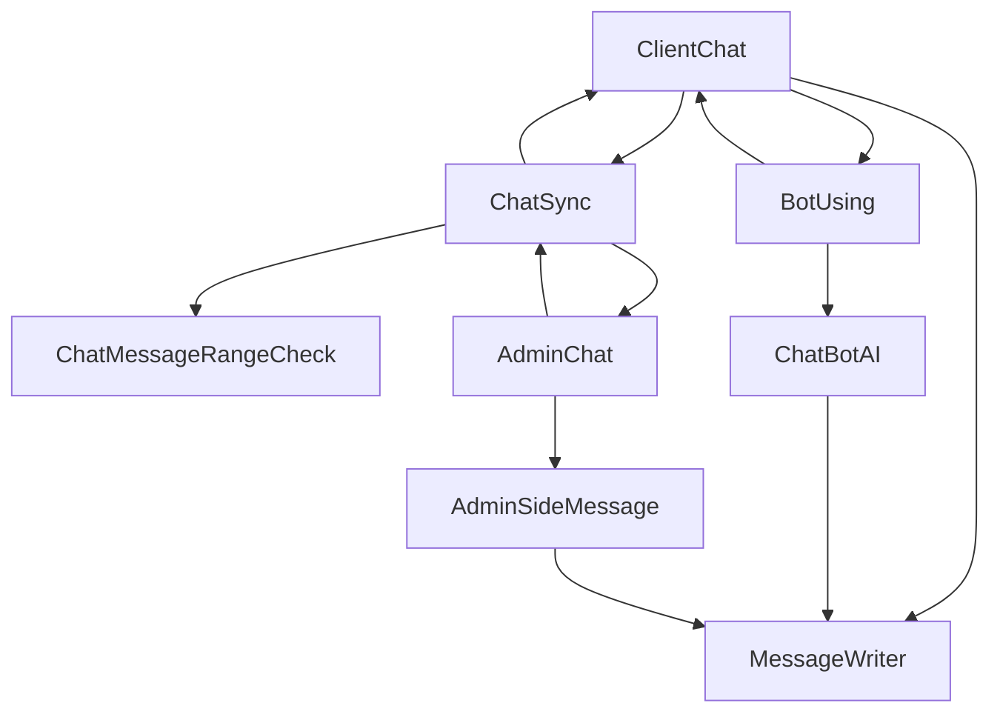

# ChatBot

##   purpose
 
	相談員不在時に自動的に問い合わせを記録させ、
	相談員の手間を省き、遅い時間にも問い合わせを可能にする。

## 機能

	 1. AIモード - 相談員不在の場合、自動応答を通じて顧客に対応する。
	 2. AIモードでアクセス性のため直接入力せず、
	 クリックなどで機能を具現する。
	 3. IPもしくはユーザーログインを通じて相談内容を記録し、
	 より便利に相談員が対応できるようにする。
	 4. チャットウィンドウにおいてHTML、CSS等のコードを使用させ、
	 多様性を高める、また、その際に発生しうるセキュリティ問題を処理する。
	 5. 個人ウェブサーバまたは一つのサーバでデータを管理し
	 個人情報保護規約を遵守する。
	 
## 予想開発環境
	Centos7 - 理由 - 最も多く使われるリナックスだから。
	
	NodeJS - 理由 - メッセージなどの処理にJクエリー
	使うと非常に遅いからだ。
	
	MongoDB - 理由 - SQLを使ったデータベースアクセスで
	チャット管理をするとかなり遅いから。
	
	Mysql - 理由 - アカウントあるいは管理者において
	必要なデータなどを保存したり、AI 用の回答部分も
	頻繁に設定を変える必要があるので。
	
## 予想期間及び必要作業
	1. インフラの構築 2日
	2. NPM - NodeJS - DotEMC 標準コントローラ作成 1週間
	3. ユーザー側ビューページ作成 - (デザイン除外) 1週間
	4. 管理者側ビューページの作成 - (デザイン除外) 1週間
	5. DB設計 3日
	6. プロトタイプ要件確認手順 ??
	7. プログラム設置スクリプト、マニュアル作成。 1週間
	8. アルファテスト  ??

## Prototype v1 FlowChart

